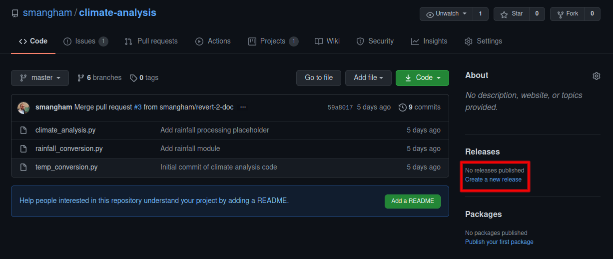
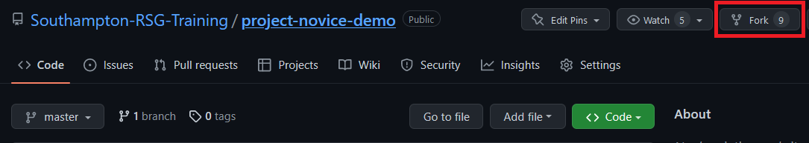
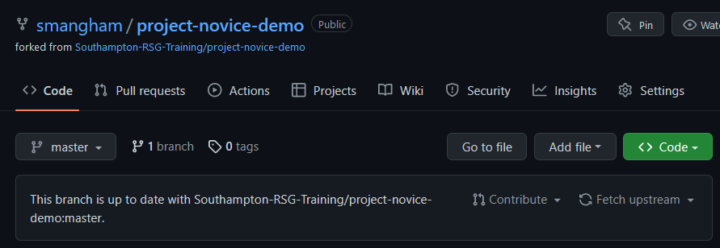

Whilst managing the development of software is essential to produce good code, managing the **distribution and release** of the software is essential to produce **impact**. If your code can't easily be found, used or worked on by collaborators, then the impact of your development work will be dramatically limited. Fortunately, repository hosting sites like GitHub and GitLab offer a wide range of tools to help.

## Releases

**It is vitally important to cite your software**. Software represents a huge expenditure of research time and energy, that is often invisible due to lack of citation. Many large software projects that underpin whole research communities are run by volunteers, because with no citations the work of the developers behind them is invisible to funders and institutions.

However, when software *is* cited, it's often done poorly, creating a barrier to reproducibility. Often, as a software project evolves, the needs change- input files are expanded to take extra data, or output files are rearranged. Techniques are refined, and bugs are fixed. The end result of this is that frequently research done with older versions of the code **cannot be reproduced with newer versions**. Just referencing your software in your paper is equivalent to referencing a methods paper that's constantly being rewritten.

Fortunately, **git commits** provide you with a snapshot of the state of your software at a single point in time. We can avoid these problems by specifying which commit we used for a paper. Actual commit IDs, though, are a bit clunky to work with and commit messages are normally more focused on specific code changes than the *scientific* state of the code. Fortunately, GitHub and GitLab make it easy to create **releases**, labels for specific versions of the code.

If we create a new release when we arrive on the final version of the code we're using in a paper, we can cite that specific version of the code- and anyone who wants to reproduce our work can easily get access to the version we used. Otherwise, we should make releases whenever we have a version of the code that's stable and reliable enough we would be happy to share it with others.

Releases fit into the **feature-branch workflow** we discussed earlier. In this you have two key branches, **master** and **development**. You create branches off your development branch to work on new features, then when they're relatively stable, you merge them **back into the development branch**. Then, after you're happy the development branch is stable and reliable, you merge it **back to the master branch**. It's those commits to the master branch that can become your releases.

### To GitHub

If you go back to your `climate-analysis` repository homepage, you can use the **Create a new release** link. We just need to give the release a name, description, and a **tag**.

Make sure you select to create a release on the **master branch**. You can do releases of your development branch for internal use, but you should always make sure your code is stable enough to go on your **master branch** before you cite it.

Whilst the name is often descriptive or a project-specific codename, the tag is usually a sequence of numbers. There are a range of strategies for tagging releases, but the most common is to tag a release in the format of **v1.0.0**. Then:

* If you fix some bugs and perform a release, **increment the last number**, e.g. `v1.0.0` to `v1.0.1`.
* If you add some new functionality **in a backwards-compatible way**, then **increment the second-to-last number** and reset the last number, e.g. `v1.0.1` to `v1.1.0`.
* If you change your code so much it's **no longer backwards compatible** (for example, your input files require a new variable so it can no longer run older ones), then **increment the first number** and reset the others, e.g. `v1.1.0` to `v2.0.0`.

This lets your collaborators know when they can safely update without breaking their ongoing work!

> ## Limitations of releases
> 
> If our code has dependencies like Python modules, we need to make sure that we include information on the specific versions of the dependencies too when creating a release. Python is well set-up to deal with this, as it can use `pip freeze` to produce a `requirements.txt` file with the current version of all the modules you're using.
>
> For more complicated dependencies, there are a range of approaches. The simplest is to list the versions of your dependencies in your `README.md`. Depending on the **software licences** of your code and its dependencies, you may be able to package them in your repository. 
>
> For low-level codes, you'll also need to list **the compiler versions and architectures used**. High-performance codes can be *very* dependent on compiler and library versions, so simply listing "GCC and OpenMPI" can cause **a lot of pain**.
>
> Bear in mind, though, that you will need to keep this information up to date if your dependencies change. 'Stale' documentation can be almost as bad as no documentation.
{: .callout}

### Issuing DOIs

Releases make it easy for others to reference a specific version of your code. However, if you want to *track* those citations, and to add the work to your academic profile on sites like [ORCID](https://orcid.org/), you'll want a **digital object identifier (DOI)** for your release. Many Universities have internal systems for issuing DOIs for software, managed by libraries or research output administrative teams. Alternatively, [Zenodo](https://zenodo.org/) allows you to upload datasets, presentations or other files to get a cached version with a specific DOI, and automatically links the DOIs to your ORCID account. 

Zenodo has great integration with GitHub, allowing you to **automatically generate a DOI for any new releases on a repository**. GitHub provide a very clear guide on how to do this:
[Citable code](https://guides.github.com/activities/citable-code/). Note, however, that Zenodo can only issue DOIs for **publicly-visible repositories**. This can be a problem if you need to keep your code private due to industrial collaborations.

> ## Citing Software
>
> Following the [Citable code](https://guides.github.com/activities/citable-code/) guide on GitHub, link your GitHub account to Zenodo, and set it up to automatically issue DOIs for releases on your `climate-analysis` repository.
>
> If your repository isn't public, you can change it to be via **Settings** and **Manage access**.
{: .challenge}

## Software licensing
 
Software licensing can be a whole topic in itself, so we’ll just summarise here. Your institution’s Intellectual Property (IP) team will be able to offer specific guidance that fits the way your institution thinks about software.

In IP law, software is considered a creative work of literature, so any code you write automatically has copyright protection applied. This copyright will usually belong to the institution that employs you, but this may be different for PhD students. If you need to check, this should be included in your employment / studentship contract or talk to your university’s IP team.

Since software is automatically under copyright, without a license no one may:

* copy it
* distribute it
* modify it
* extend it
* use it (unclear - this has not been properly tested in court yet)

Fundamentally there are two kinds of license, **Open Source** licenses and **Proprietary licenses**, which serve slightly different purposes.

**Proprietary licenses** are designed to pass on limited rights to end users, and are most suitable if you want to commercialise your software. They tend to be customised to suit the requirements of the software and the institution to which it belongs - again your institutions IP team will be able to help here.

**Open Source** licenses are designed more to protect the rights of end users - they specifically grant permission to make modifications and redistribute the software to others. The website Choose A License provides recommendations and a simple summary of some of the most common open source licenses.

Within the open source licenses, there are two categories, **copyleft** and **permissive**. The permissive licenses such as MIT and the multiple variants of the BSD license are designed to give maximum freedom to the end users of software. These licenses allow the end user to do almost anything with the source code.

The copyleft licences in the GPL still give a lot of freedom to the end users, but any code that they write based on GPLed code must also be licensed under the same license. This gives the developer assurance that anyone building on their code is also contributing back to the community. It’s actually a little more complicated than this, and the variants all have slightly different conditions and applicability, but this is the core of the license.

Which of these types of license you prefer is up to you and those you develop code with. If you want more information, or help choosing a license, the [Choose An Open-Source License](https://choosealicense.com/) site can help. 

## Forks

'Forking' a repository is similar to creating a new branch, but on a much larger scale- you create your own copy of the **whole repository**, that is **linked back to the original**.

For some large projects, or open-source projects, it's not practical to have all the collaborators working on the same repository. Multiple different developers might both create branches with the same name, leading to conflicts, and developers can end up with access to dozens of work-in-progress branches they don't know anything about. Others limit the ability of unauthorised users to push to the repository to prevent abuse, or accidental uploads of sensitive or restricted material. In these contexts, it makes more sense for **every collaborator to have their own fork**. Then, once they finish work on a feature branch, they can **submit a pull request back to the original**.

We're going to create a fork of an existing repository- `swc-rf4`. [Go to the repository on GitHub](https://github.com/Southampton-RSG/swc-rf4), and click **Fork**. You can fork a repository to your own account, or any **Team** you have access to. For now, we'll clone a personal copy.

As you can see, the fork looks and works just like a normal repository, but handily tells you how far you are behind the original.

You may also be able to use forks to create modified versions of existing codes that better suit your needs, depending on their software license. It is good practise to submit your modifications and improvements back to the original, though.


